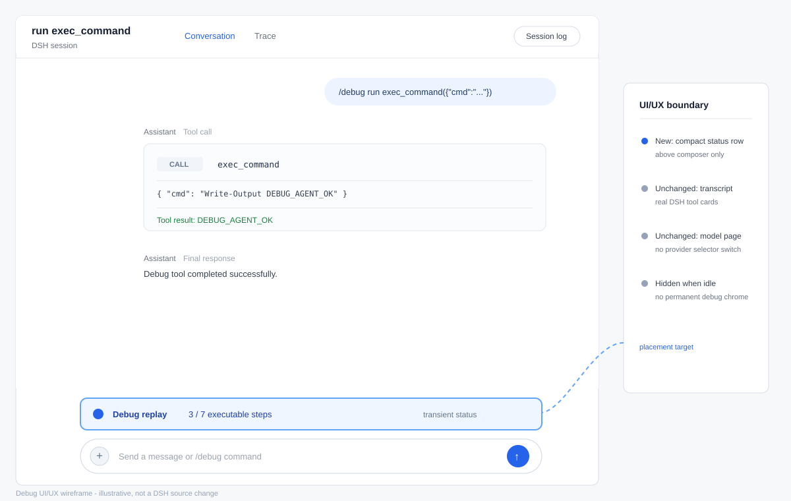
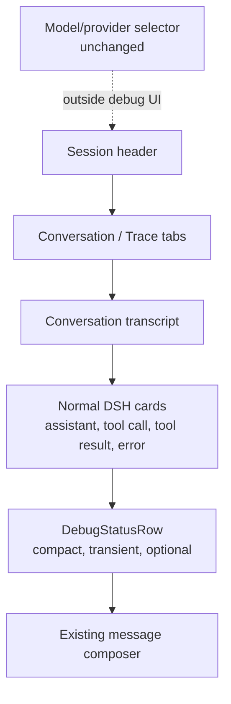
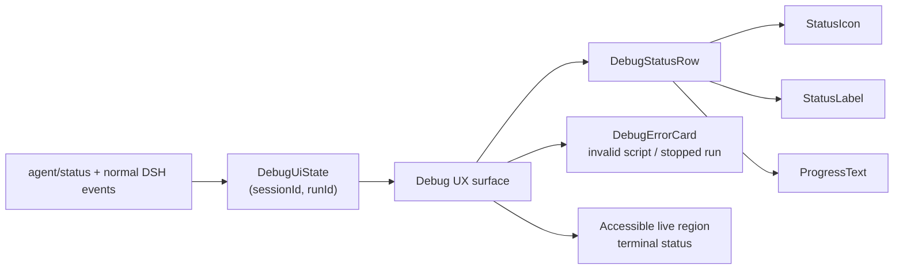

# Debug UI/UX design and logic

This document defines the small UI/UX surface for the external `debug-agent`
plugin. Debugging is initiated by a slash command in the existing DSH session;
it is not a new model-page mode and does not replace the model/provider
selector.

## 1. Design goals

- Keep the normal DSH transcript authoritative. Real tool-call, tool-result,
  error, and durable-event cards come from the normal AgentLoop and
  ToolRuntime.
- Show only enough transient state to make a replay feel like an active agent
  turn.
- Never invent a tool call, tool result, or parallel-execution message in the
  UI.
- Keep debug state scoped to `sessionId` and `runId`, so another session cannot
  consume or display this run's progress.

The plugin must not add a model-page selector, permanently switch
`ctx.llm`, patch `AgentLoop`, or modify DeepSeek Harness source. The
`ui/` folder is the design and host-integration boundary for this feature; the
v1 plugin remains otherwise minimal.

## 2. Placement

Place one compact, transient status row immediately above the existing message
composer at the bottom of the session view. It should use the same width as
the composer and disappear when there is no active debug run.

Do not add a panel to the model page, a sidebar, or a large debug transcript.
The submitted `/debug ...` text may remain the normal user message, but the
plugin must not add a separate command-display card. In particular, do not
show text such as `Running 2 tools in parallel`.

Recommended active presentation:

```text
  ◌  Debug replay · 3/7
```

The indicator is deliberately generic. The actual tool name, arguments,
output, and errors appear in the ordinary DSH cards produced by the runtime.

### 2.1 Placement in the DSH web UI



The blue row in the illustration is the proposed debug component. It sits
between the transcript and the existing composer, uses the session's normal
width, and disappears when the run reaches a terminal state.



The status row belongs in the existing session surface, directly above the
composer. It is not a new conversation message, model-page control, sidebar,
or replacement for the transcript cards.

### 2.2 UI component boundary



`DebugStatusRow` is the only persistent active component. `DebugErrorCard` is
rendered only for a validation or fail-fast terminal error. The host should
reuse its existing spinner, typography, spacing, and error-card primitives;
the plugin supplies state and labels rather than a second visual language.

## 3. State model

The UI state is ephemeral and keyed by `sessionId` and `runId`:

```ts
type DebugUiState = {
  sessionId: string
  runId: string
  mode: "run" | "replay"
  phase: "queued" | "running" | "waiting" | "failed" | "completed" | "cancelled"
  currentStep: number       // 1-based executable step, or 0 before start
  totalSteps: number        // wait steps are excluded
  errorCode?: string
  errorMessage?: string
}
```

`phase` is plugin progress. DSH's agent lifecycle remains the source of truth
for whether the session is active:

| Plugin phase | DSH agent status | Meaning |
| --- | --- | --- |
| `queued` | `running` once submitted | The command was accepted and is being started. |
| `running` | `running` | The adapter is streaming or the runtime is executing a tool. |
| `waiting` | `running` | The adapter is in an explicit or implicit inter-step wait. |
| `failed` | `idle` after the turn ends | Validation or runtime failure stopped the run. |
| `completed` | `idle` | All executable steps and the final response completed. |
| `cancelled` | `idle` after cancellation | The active turn was aborted and remaining work was discarded. |

The UI must not infer completion merely because the adapter has emitted one
tool call. A replay stays active until the real AgentLoop has executed the
current call, the adapter has emitted all remaining calls, and the final
response has completed.

## 4. Progress rules

Progress counts top-level executable canonical steps only:

- one tool step counts as one;
- one `parallel` group counts as one, regardless of member count;
- a `wait` step counts as zero;
- implicit 100 ms gaps also count as zero;
- the final response is not a separate step.

For example, this script has three displayed steps:

```json
{
  "steps": [
    {"tool": "a", "args": {}},
    {"wait": 250},
    {"parallel": [
      {"tool": "b", "args": {}},
      {"tool": "c", "args": {}}
    ]},
    {"tool": "d", "args": {}}
  ]
}
```

The status is `Debug replay · 1/3`, then `2/3`, then `3/3`. While the
explicit wait is running, keep the same completed/current step numbers and
change only the phase internally to `waiting`; do not display the wait as a
fake tool step. Do not estimate progress from wall-clock time.

For `/debug run`, `totalSteps` is `1` for a single tool or one parallel group.

## 5. UX behavior by scenario

| Scenario | Component state | User-visible behavior | Runtime meaning |
| --- | --- | --- | --- |
| No debug run | No active row | Normal composer only | No debug state exists. |
| Valid `/debug run` | `queued` then `running` | Show a generic spinner and `Debug run - 1/1` | The real AgentLoop turn is active. |
| Valid `/debug replay` | `queued` then `running` | Show `Debug replay - current/total` | The in-memory canonical queue is being consumed. |
| Explicit or implicit wait | `waiting` | Keep the row visible; do not add a fake tool card or count the wait | The agent remains `running` until the wait finishes. |
| Parallel group | `running` | Keep one progress item for the group; show member activity only through normal DSH cards | Sibling calls are emitted and executed as one AgentLoop tool-call step. |
| Invalid command/script | `failed` | Show `Debug script invalid - INVALID_SCRIPT` with source location; no active spinner remains | Validation stopped the run before the adapter streamed. |
| Unknown tool | `failed` | Preserve `UNKNOWN_TOOL`, identify the step, and say later steps were stopped | The real ToolRuntime rejected the call. |
| Missing/invalid arguments | `failed` | Preserve `INVALID_ARGS` and the normal DSH error presentation | The real ToolRuntime performed validation. |
| Policy/approval pending | `running` | Keep the row active and use the normal approval UI | The AgentLoop is waiting for the policy/approval result. |
| Policy denial/tool/output error | `failed` | Preserve the normal DSH error and stop later steps | No retry or substitution is performed. |
| Interrupt | `cancelled` | Stop the spinner after DSH cancellation settles; do not show completion | The active stream/wait was aborted and the queue cleared. |
| Debug follow-up or steer | New `queued` debug turn | Route the slash command to debug; follow-up and steer look the same | Both are treated as the next debug turn. |
| Non-slash follow-up or steer | No debug row unless another run exists | Use the normal real-agent UI | The configured real provider handles the turn. |
| Background-job tool | `running` until parent tool returns | Keep debug progress tied to the parent step; show job status through normal DSH job UI | Background work is not flattened into replay steps. |
| Subagent-spawning tool | `failed` or explicit unsupported state | Explain that deterministic replay does not support nested subagents | Child sessions are not silently replayed or counted. |
| Completion | `completed` briefly, then removed | Final response and normal durable events remain; active row disappears | The queue is empty and the AgentLoop is idle. |
| Two concurrent sessions | Independent rows | Each session shows only its own run/progress/error | State is keyed by `(sessionId, runId)`. |

## 6. State transitions and rendering

The command handling path is:

1. Classify a message beginning with `/debug` as a debug turn. A debug command
   received through follow-up or steer uses the same next-turn queueing
   semantics; steer has no additional meaning for debug.
2. Parse and validate the command. For replay, convert the source file to the
   canonical script and validate that canonical output before any tool call.
3. Create an in-memory `DebugUiState` and a session-scoped replay queue.
4. Set `queued`, then `running` when the adapter stream starts.
5. Let the adapter emit normal DSH tool-call chunks. The real AgentLoop sends
   them through the normal `ctx.tools`/ToolRuntime pipeline.
6. After a tool result, advance the executable-step counter. If a wait is
   required, set `waiting` while the adapter waits with the request abort
   signal, then return to `running`.
7. Emit the final response only after the queue is empty. Mark the run
   `completed` after the AgentLoop turn reaches its terminal state, then remove
   the active row.

The host may implement these transitions from plugin lifecycle events such as
`debug/run-started`, `debug/step-started`, `debug/wait-started`,
`debug/step-completed`, `debug/run-failed`, `debug/run-completed`, and
`debug/run-cancelled`. These are UI hints, not replacements for DSH's durable
tool and agent events. If an event is lost, the UI should fall back to the
session's current `agent/status` and remove stale active state when the run is
idle.

### 6.1 Command-to-UI and runtime flow

```mermaid
sequenceDiagram
  participant User
  participant Composer as Existing composer
  participant Router as Debug command router
  participant State as DebugUiState
  participant Adapter as Mock adapter
  participant Loop as Real AgentLoop
  participant Runtime as Real ToolRuntime
  participant Cards as Normal DSH cards

  User->>Composer: /debug run or /debug replay
  Composer->>Router: submit slash command
  Router->>Router: parse, convert, validate
  Router->>State: create session-scoped run
  State-->>Composer: show DebugStatusRow
  Router->>Loop: start normal DSH turn
  Loop->>Adapter: request model stream
  Adapter-->>Loop: normal tool-call chunks
  Loop->>Runtime: execute through ctx.tools
  Runtime-->>Cards: tool call, result, error, durable events
  Cards-->>State: step/status events
  Adapter-->>Loop: wait or next scripted call
  Loop-->>Adapter: tool results
  Adapter-->>Loop: final response after queue is empty
  Loop-->>State: idle / terminal event
  State-->>Composer: remove or replace status row
```

The adapter never calls `Runtime` directly. This is why the UI can show the
normal DSH tool cards and preserve unknown-tool, argument, policy, approval,
execution, output, and cancellation semantics.

## 7. Error states

### Invalid script

Show a compact error card associated with the submitted command:

```text
Debug script invalid · INVALID_SCRIPT
<source location and actionable message>
```

No adapter stream or tool execution starts. The session returns to idle.

### Invalid or unknown tool

Let the real DSH runtime produce the error. The UI may add a compact stop
summary, but must preserve the normal `UNKNOWN_TOOL` or `INVALID_ARGS` code,
tool name, and source step. Mark the run failed and skip all later steps.

The same fail-fast rule applies to policy/approval failures, tool execution
errors, and invalid tool output according to normal DSH behavior. The UI must
not retry, substitute a tool, or report later steps as completed.

## 8. Cancellation, follow-up, and steer

An interrupt uses normal DSH cancellation. It aborts the adapter's active
stream or wait, clears the remaining in-memory queue, marks the run
`cancelled`, and waits for DSH to report the session idle. It must not emit a
synthetic final tool result.

If the next message starts with `/debug`, route it to debug command handling,
whether it arrived as a normal message, follow-up, or steer. Treat follow-up
and steer identically for this purpose. A non-slash next message uses the
normal real provider path. Therefore one session can alternate between debug
turns and real-agent turns without changing the configured model page.

## 9. Background tools and subagents

A tool that starts a background job is allowed. The debug row tracks the
top-level tool step until the tool returns; the normal DSH job UI/lifecycle
tracks the background job separately. The debug row must not claim that the
background work has completed unless the tool's own contract says the step
completed.

Nested subagent orchestration is not part of deterministic replay. If a tool
is marked as spawning a subagent, reject it before execution or report the
normal explicit unsupported error. Do not flatten child sessions into the
parent progress counter or pretend their steps are replayed.

## 10. Accessibility and stale-state cleanup

- Use a text label alongside the spinner; do not communicate state by color
  alone.
- Announce terminal failures and cancellation in an `aria-live` status region.
- Keep error text selectable and include the canonical step number.
- On plugin disposal, session close, abort, or an idle terminal event, remove
  the matching `(sessionId, runId)` row. Never clear another session's state.

The UI behavior is covered by the cases in `test.md`, especially progress
sanitization, invalid-script rendering, fail-fast errors, cancellation, and
session isolation.
