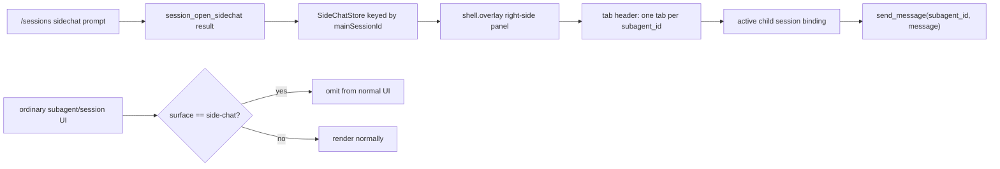
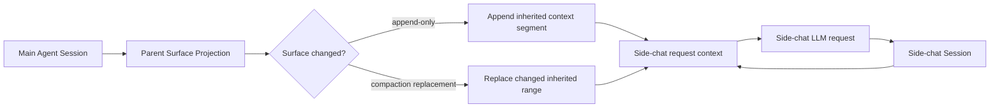
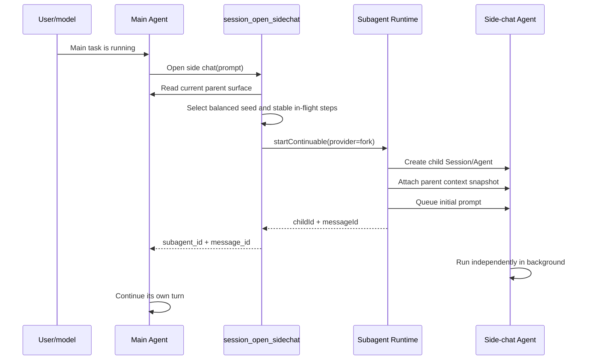
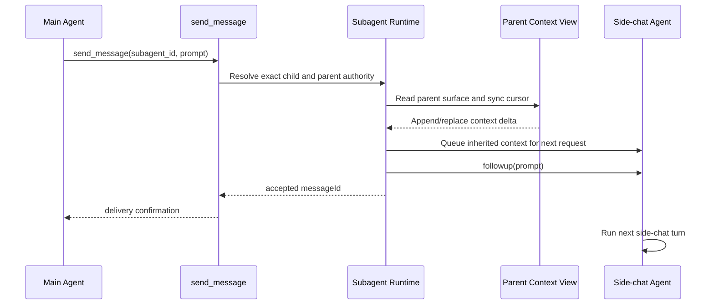
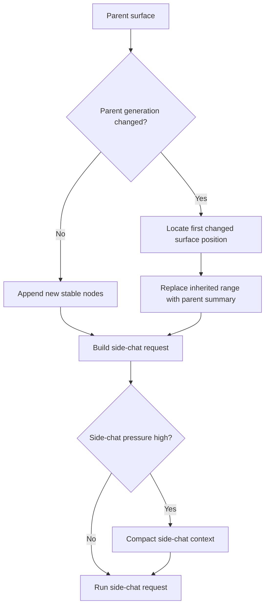

# dsh-sessions side-chat design specification

Status: implemented in `dsh-sessions` and DeepSeek Harness. This revision incorporates
the current `dsh-sessions` UI/runtime review and the DeepSeek Harness lifecycle
and compaction review.

This document defines a side chat as a special continuable subagent attached to
the calling main agent. It deliberately reuses the existing Harness subagent
identity and control tools instead of introducing a second conversation ID
system.

## 1. Design goals

The side chat must:

- return the real durable `subagent_id`;
- be launched while the parent agent is working;
- inherit the parent agent's model-visible context;
- include completed steps from an in-flight parent turn;
- continue through the existing `send_message` tool;
- synchronize only the parent context delta on later messages;
- understand parent compaction and surface replacements;
- preserve the unchanged prompt prefix for provider cache reuse;
- remain a real continuable subagent with its own durable transcript.

The side chat must not:

- create a separate `side_chat_id`;
- introduce a second send/follow-up tool;
- copy raw parent session events into the child session;
- wait for the parent turn to end before it can be opened;
- rebuild the complete inherited transcript on every follow-up.

## 2. Identity and public API

`session_open_sidechat` is a sessions-level wrapper over the existing
continuable subagent service. Its result exposes the actual child session ID:

```ts
session_open_sidechat({
  prompt: string,
}) -> {
  subagent_id: string,
  message_id: string,
  accepted: true,
  status: "running",
}
```

The returned `subagent_id` is the child Session ID and the ID accepted by the
existing Harness subagent tools:

```ts
send_message({
  subagent_id: "<returned id>",
  message: "Continue the analysis with the latest context.",
})
```

```ts
list_agents({ scope: "children" })
```

```ts
session_read({ session_id: "<returned id>" })
```

`send_message` remains the only continuation API. The existing
`dsh-sessions` `session_send` tool continues to serve ordinary session
delivery; it is not required for side-chat continuation.

The slash-command entry point is:

```text
/sessions sidechat "Investigate the failing integration test while I continue."
```

The command uses the currently selected main session as the parent and returns
the same structured result as `session_open_sidechat`. The client uses that
result to open the side-chat panel; it must not navigate the main conversation
to the child session.

The child is recorded as a normal durable continuable subagent with an
additional descriptor surface classification:

```ts
{
  mode: "continuable",
  surface: "side-chat",
  parentSession: "<main session id>",
  provider: "fork",
}
```

Because the returned value is the real `subagent_id`, the side chat remains
addressable by the existing Harness APIs and durable session readers.
`surface: "side-chat"` lets ordinary catalogs and navigation filter it without
changing its identity or continuation semantics; the side-chat panel is the
default presentation.

### 2.1 UI projection and filtering

Side chats remain real child sessions for persistence and tool access, but they
are a separate UI projection. They must not be rendered in the ordinary
subagent list, child-agent tree, or main session navigation. Any general child
projection should filter `surface: "side-chat"`; the side-chat panel is the
sole default presentation for these children.

The panel is a root-scoped `shell.overlay` right-side sheet. It is persistent
while open and owns a client-side store keyed by the selected main session:

```ts
interface SideChatPanelState {
  mainSessionId: string
  open: boolean
  activeSubagentId: string | null
  tabs: readonly SideChatTab[]
}

interface SideChatTab {
  subagentId: string
  title: string
  status: "running" | "idle" | "finished" | "error"
  residency: "live" | "cold"
  canContinue: boolean
  unread: boolean
}
```

Each tab is keyed by the actual `subagent_id`. Its conversation view reads the
child's existing session binding/snapshot, while its composer sends through
the existing `send_message` path. Selecting a tab changes only the panel's
active child; it does not change the main session selected in the application.



The panel should expose activity and lifecycle independently. `idle` means the
child is resident and between turns; `finished` means its latest activation
settled successfully but it remains continuable; `error` records the latest
failure and remains retryable when authorized. `residency` (`live`/`cold`) is
not a completion state.

## 3. High-level mechanism

The side chat has its own Agent and Session, but its request context is
assembled from two sources:

1. the side chat's own durable conversation;
2. a live, compaction-aware projection of the parent session.

The parent projection is not copied into the child as raw session events.
Instead, it is represented as append/replace context segments that preserve the
child's session invariants and can be reconstructed after a cold resume.



The resulting request is conceptually:

```text
stable side-chat prefix
+ side-chat conversation
+ inherited parent context segments
+ current side-chat prompt
```

Only the suffix after the last unchanged prefix is changed between requests.
This gives the selected provider the best opportunity to reuse its prompt/KV
cache. Cache reuse is provider-dependent, but the Harness never forces a full
history rebuild for an ordinary append.

## 4. Opening a side chat

The open operation requires an exact live calling Agent. It uses the `fork`
continuable provider so the child receives the parent's completed conversation
prefix and keeps the parent's model/provider route unless an explicit future
side-chat option overrides it.

The fork seed ends at the last balanced `turn/end`. A parent turn may still be
open. The current turn's stable, completed-step context is supplied through the
attached parent projection rather than by making an invalid open-turn seed.



The initial parent context snapshot may include:

- all messages in the completed parent trace;
- the current user prompt;
- assistant/tool exchanges from completed steps in the open turn.

It must exclude an open assistant stream, an unresolved tool call, or any
other incomplete step. The snapshot is taken at the request boundary and is
not modified while the side-chat LLM request is already streaming.

## 5. Continuing with `send_message`

`send_message` keeps its existing public contract and returns an accepted inbox
`messageId`, not the side-chat answer:



The continuation manager serializes context synchronization and follow-up
delivery per child. Two concurrent `send_message` calls cannot observe the
same parent cursor and append the same context segment twice.

Resident children receive the update through their live Activation. Cold
children reconstruct the context projection from durable side-chat metadata
and the current parent surface before their next turn is admitted.

## 6. In-flight parent turns

Side-chat synchronization uses the latest completed `step/end`, not the latest
completed `turn/end`.

```text
turn 12
  step 1: completed  ─┐
  step 2: completed  ─┼─ eligible for side-chat context
  step 3: running    ─┘  not yet eligible
```

This allows a side chat to answer questions while the main agent is processing
tools or working through a multi-step turn.

When the parent completes another step:

1. the parent session surface advances;
2. the parent context projection records the new stable segment;
3. the side chat receives it before its next LLM request.

If the side chat is already streaming, the new parent step does not mutate its
current request. It is queued for the next side-chat step or follow-up.

## 7. Compaction-aware synchronization

A raw event sequence cursor is insufficient. Compaction appends a new summary
node while replacing an earlier surface range. The parent context view must
track both:

```ts
interface ParentContextCursor {
  parentSessionId: string
  surfaceGeneration: number
  stableSurfaceNodes: readonly number[]
  stableStepBoundary: {
    turn: number
    step: number
  }
}
```

Synchronization rules:

### 7.1 Append-only parent changes

When `surfaceGeneration` is unchanged and the current stable surface extends
the previous surface, append only the new inherited messages.

```text
previous parent surface: [A, B, C]
current parent surface:  [A, B, C, D, E]
side-chat update:                         append [D, E]
```

### 7.2 Parent compaction

When `surfaceGeneration` changes, find the first changed surface position and
replace only the inherited range after that point.

```text
previous parent surface: [A, B, C, D, E]
compacted parent surface: [A, B, S, E]
                                   ^
                         changed range begins here
side-chat update: replace inherited [C, D] with [S]
```

The compaction summary already produced for the parent is reused. Side-chat
synchronization must not run a second summarization call for the same parent
range.

The unchanged prefix before the replacement remains cache-compatible. Only
the provider prompt suffix beginning at the replacement point may lose cache
reuse.

### 7.3 Side-chat compaction

The side chat has its own context-window and compaction policy. It may compact
its own conversation and inherited context without mutating the parent.
Side-chat compaction must preserve the parent cursor and the provenance of any
inherited summary so later parent updates continue from the correct boundary.



## 8. Request-context contract

The current Harness `agent/request` configuration waterfall changes provider
and model configuration but does not change the model message list. The
side-chat feature therefore needs a request-context extension with append and
replace semantics.

Conceptually:

```ts
interface InheritedContextSegment {
  sourceSessionId: string
  sourceGeneration: number
  sourceSurfaceStart: number
  sourceSurfaceEnd: number
  messages: readonly Message[]
}

interface InheritedContextUpdate {
  kind: "append" | "replace"
  replaceFrom?: number
  segments: readonly InheritedContextSegment[]
}
```

The extension must be applied before the side-chat LLM request is created and
must be durable enough for cold resume. It should preserve assistant, user,
tool-call, and tool-result roles rather than flattening the parent trace into
one plain user string.

`Agent.inject()` is useful for ordinary context notifications, but by itself it
does not provide the required role-preserving replacement behavior for parent
compaction. It may be used as the delivery mechanism for a prepared inherited
context update, but the update itself belongs to the side-chat context layer.

### 8.1 Independent Harness implementation

The reusable extraction and delta logic belongs in the DeepSeek Harness, not in
the `dsh-sessions` plugin. Place it in an independent Cordis-free module such
as:

```text
deepseek-harness/packages/core/session/src/model-context.ts
```

The module should depend on session event/surface types and the LLM `Message`
type, but not on the concrete `Session` class or UI. The future fork tool and
side-chat provider can then share it.

The canonical model-visible source is `Session.surface.nodes`, including its
compaction replacement nodes. `Session.deriveMessages()` is a convenient full
snapshot, but it does not provide enough provenance for safe incremental
updates. The independent module should expose:

```ts
interface SessionSurfaceReader {
  readonly id: string
  readonly events: readonly unknown[]
  readonly surface: { nodes: readonly unknown[]; replaceGeneration: number }
  deriveEventMessage(event: unknown): Message | null
}

interface ModelContextProjection {
  snapshot(): ModelContextSnapshot
  deltaSince(cursor: ParentContextCursor): ParentContextDelta
  planForkSeed(): StableStepBoundary
}
```

The projection must retain surface-node identity even when a node produces no
model message. Delta replacement positions are surface-node ordinals, not raw
event sequence numbers. A cursor advances only after the child context update
is durably applied; a failed or stale update is retried from the prior cursor.

The fork seed owns the parent surface nodes it covers. The inherited projection
must begin after that boundary, or the same parent messages will be duplicated
in the child request.

## 9. Background and settlement behavior

The side chat is a background continuable subagent, not a generic Jobs Task.
`session_open_sidechat` returns after the initial prompt is accepted. The child
then owns its own turns and can remain active while the parent continues.

When the child settles, the existing continuation manager sends a settlement
notice to the parent:

- an idle parent receives a normal later turn;
- a busy parent receives steering at the next safe step boundary;
- a parent already draining receives quiet injected context;
- if the parent is no longer live, the notice may be dropped, while the child
  Session remains the durable record.

The child can be interrupted with the existing `interrupt_agent` tool. A later
`send_message` can continue it unless the child was disposed or is no longer
authorized under the parent lineage.

### 9.1 Main-agent termination is not a child-turn dependency

There are two different events:

- `turn-end`: the main agent finishes its current turn. The side chat keeps
  running, and the main turn does not await generation, settlement, or cleanup
  of the side chat.
- `parent-close`: the main agent/session is actually disposed. The current
  Harness host drains continuable descendants during teardown, which can make
  host shutdown wait for child cancellation and final flushes.

To satisfy the product requirement that main-agent termination be wait-free,
side chats need an explicit background ownership policy. The recommended
contract is:

1. normal main turns never wait for side chats;
2. parent close marks the side chat as detached/orphaned and returns without
   awaiting its generation;
3. a side-chat supervisor owns the remaining activation and records its final
   outcome durably;
4. host shutdown may perform bounded best-effort cleanup, but must have a
   force-release path and must not make the user-facing main-agent operation
   depend on child completion.

If the host cannot provide a supervisor, the safe fallback is to cancel live
side chats on parent close while retaining their durable sessions. That
fallback is non-blocking for the main operation but does not promise that an
in-flight side chat finishes after process teardown. A future explicit
`detach` lifecycle operation can make this distinction user-visible.

Settlement notices are best-effort UI notifications, not the source of truth:
persist the latest outcome before attempting delivery, include an activation or
settlement sequence, and deduplicate notices. If the parent is gone, the child
session and side-chat projection remain authoritative.

## 10. Authorization and lifecycle

- Opening requires the exact live calling parent Agent.
- Continuing requires the exact live direct parent Agent, as with ordinary
  continuable subagents.
- The returned `subagent_id` is not an alias and must not be remapped to a
  second public identity.
- Continuable persistence is required for cold resume.
- The child has its own Session and Agent; it is attached by durable
  `parentSession` lineage, not by sharing the parent's Session object.
- Parent teardown follows the explicit `turn-end`, `parent-close`, and future
  `detach` policy above; it must not accidentally turn a normal main-agent
  turn into a child wait dependency.

## 11. Race and failure rules

| Situation | Required behavior |
| --- | --- |
| Parent step is still open | Use the last completed step boundary; exclude incomplete events. |
| Parent produces a new completed step during side-chat execution | Apply it before the next side-chat request. |
| Parent compacts during synchronization | Re-read the surface generation and retry from the new cursor. |
| Two follow-ups arrive concurrently | Serialize sync plus delivery per `subagent_id`. |
| Side chat is cold | Restore the child and its inherited-context cursor before delivery. |
| Parent is gone | Reject new parent-authorized follow-up; retain the durable child record. |
| Parent context exceeds the child budget | Apply side-chat compaction; never silently drop the newest side-chat prompt. |
| Context update fails | Do not advance the parent cursor or claim the follow-up as synchronized. |
| Provider cache is unavailable | Continue with correct context; cache reuse is an optimization, not correctness. |

## 12. Suggested implementation phases

1. Add the reusable Harness `model-context.ts` projection and its unit tests.
2. Add `surface: "side-chat"`, parent lineage, activation outcome, and
   detach/orphan metadata to the durable subagent descriptor/projection.
3. Add `session_open_sidechat`, backed by `startContinuable()` and the fork
   provider, returning `subagent_id` and the accepted initial `message_id`.
4. Define the parent-context cursor and durable inherited-context segment
   projection.
5. Add request-context append/replace support to the child Agent request
   assembly.
6. Extend the continuation path so existing `send_message` synchronizes a
   side-chat child before calling `followup()`.
7. Add in-flight step-boundary synchronization.
8. Add the `/sessions sidechat` parser/command and the persistent tabbed
   `shell.overlay` panel; filter side chats from ordinary child UI.
9. Add compaction-generation replacement and side-chat compaction tests.
10. Add E2E prompts covering open-while-running, follow-up-after-parent-change,
   compaction, cold resume, concurrent delivery, and settlement notices.

## 13. Acceptance criteria

- `session_open_sidechat` returns a real `subagent_id`.
- `/sessions sidechat "prompt"` opens the panel for the current main session.
- No `side_chat_id` is created or required.
- Existing `send_message` continues the side chat.
- `list_agents` reports the child as a continuable child.
- Side chats are filtered from ordinary subagent/session UI and appear in a
  tabbed right-side panel.
- The side chat can open while the parent has an active turn.
- Completed parent steps are visible without waiting for `turn/end`.
- Incomplete current steps are excluded from the inherited context.
- Parent append-only changes add only a context suffix.
- Parent compaction replaces only the changed inherited range.
- The unchanged prompt prefix remains available for provider cache reuse.
- Parent and side-chat compaction remain independent and durable.
- A child can cold-resume with its parent cursor and side-chat history.
- Concurrent follow-ups are ordered and do not duplicate context deltas.
- The main turn does not wait for side-chat generation or settlement.
- Parent-close behavior is explicit and has a bounded/non-blocking path.
- The durable side-chat projection contains the final response even if parent
  settlement delivery is unavailable.

## 14. Expected project structure

The implementation is split between the plugin-facing integration and the
Harness primitives it depends on.

```text
dsh-plugins/sessions/
├── src/
│   ├── commands.ts                         # /sessions sidechat parser
│   ├── types.ts                            # public side-chat types
│   ├── sidechat/
│   │   ├── sidechat-service.ts              # open and coordinate side chats
│   │   ├── sidechat-types.ts                # plugin state/result types
│   │   └── sidechat-lifecycle.ts            # plugin-side projection/state
│   ├── tools/
│   │   ├── session-open-sidechat.ts         # session_open_sidechat
│   │   └── ...
│   └── ui/
│       └── sidechat/
│           ├── SideChatPanel.tsx             # right-side shell.overlay
│           ├── SideChatTabs.tsx              # multiple child tabs
│           ├── SideChatConversation.tsx      # active child binding
│           ├── SideChatComposer.tsx          # send_message entry point
│           ├── sidechat-store.ts             # main-session keyed UI state
│           └── *.module.css
└── test/
    ├── commands/sidechat.test.ts
    ├── tools/session-open-sidechat/
    ├── sidechat/
    │   ├── service.test.ts
    │   ├── lifecycle.test.ts
    │   └── concurrency.test.ts
    ├── ui/
    │   ├── sidechat-panel.test.ts
    │   └── sidechat-filtering.test.ts
    └── e2e/prompts/
        ├── session-sidechat-open.md
        ├── session-sidechat-followup.md
        └── session-sidechat-multiple-tabs.md

deepseek-harness/packages/core/session/
├── src/model-context.ts                    # shared extraction/delta logic
└── tests/model-context*.spec.ts

deepseek-harness/packages/subagent/subagent/
├── src/descriptor.ts                        # side-chat surface metadata
├── src/continuation.ts                       # continuable delivery
├── src/lifecycle.ts                          # parent-close/detach policy
└── tests/sidechat-*.spec.ts
```

`model-context.ts` must remain outside `dsh-sessions`; it will also be used by
the future fork implementation. The plugin should own command parsing, tool
registration, panel state, and UI filtering, while the Harness owns context
correctness, continuation authority, persistence, and lifecycle guarantees.
